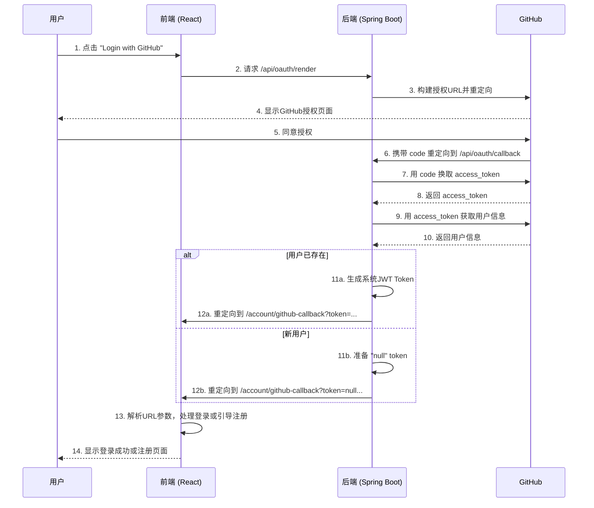

# GitHub 登录集成教程 (Java Spring Boot + React)

本教程将根据你的项目实践，详细指导你完成从创建 GitHub OAuth App 到前后端代码实现的完整流程。该方案采用**前后端分离**架构，后端负责安全通信，前端负责用户交互和状态管理。

## 1. 准备工作：创建 GitHub OAuth App

这一步是所有实现的基础，保持不变。

1. 登录你的 GitHub 账户，进入 **Settings** > **Developer settings** > **OAuth Apps**。
2. 点击 **"New OAuth App"**。
3. 填写应用信息：
   - **Application name**: 你的应用名称 (例如: PetStore)。
   - **Homepage URL**: 你的前端应用主页地址 (例如: `http://localhost:5173`)。
   - **Authorization callback URL**: **极其重要**。这是用户授权后 GitHub 跳转回的你的**后端API地址**。根据你的代码，应填写 `http://localhost:8070/api/oauth/callback`。
4. 点击 **"Register application"**。
5. 在应用详情页，你将获得 **Client ID** 和 **Client Secret**。请妥善保管 `Client Secret`，它绝不能出现在前端代码中。

## 2. 后端实现 (Java Spring Boot + JustAuth 示例)

后端使用 [JustAuth](https://github.com/justauth/JustAuth) 库来简化 OAuth 流程，这是一个非常高效的选择。

### 步骤 1: 添加 Maven 依赖

在你的 `pom.xml` 文件中，确保已添加 `JustAuth` 的依赖。

```xml
<dependency>
    <groupId>me.zhyd.oauth</groupId>
    <artifactId>JustAuth</artifactId>
    <version>1.16.5</version> <!-- 建议使用最新稳定版 -->
</dependency>
```

### 步骤 2: 安全地配置密钥 (推荐)

在你的 `OAuthController.java` 中，密钥是硬编码的。**强烈建议**将它们移至 `application.yml` 或 `application.properties` 文件中进行统一管理，这样更安全、更灵活。

**在 `src/main/resources/application.yml` 中配置:**

```yaml
github:
  oauth:
    client-id: 你的 Client ID
    client-secret: 你的 Client Secret
    redirect-uri: http://localhost:8070/api/oauth/callback
```

### 步骤 3: 编写 Controller

例如：

```java
package org.csu.petstore.controller;

import cn.hutool.json.JSONObject;
import cn.hutool.json.JSONUtil;
import jakarta.servlet.http.HttpServletResponse;
import me.zhyd.oauth.config.AuthConfig;
import me.zhyd.oauth.model.AuthCallback;
import me.zhyd.oauth.model.AuthResponse;
import me.zhyd.oauth.request.AuthGithubRequest;
import me.zhyd.oauth.request.AuthRequest;
import me.zhyd.oauth.utils.AuthStateUtils;
import org.csu.petstore.entity.SignOn;
import org.csu.petstore.service.AccountService;
import org.csu.petstore.utils.JwtUtil;
import org.springframework.beans.factory.annotation.Autowired;
import org.springframework.beans.factory.annotation.Value;
import org.springframework.web.bind.annotation.*;

import java.io.IOException;
import java.util.HashMap;
import java.util.Map;

@RestController
@RequestMapping("/api/oauth")
public class OAuthController {

    @Autowired
    private AccountService accountService;

    // 从 application.yml 中注入配置，避免硬编码
    @Value("${github.oauth.client-id}")
    private String clientId;
    @Value("${github.oauth.client-secret}")
    private String clientSecret;
    @Value("${github.oauth.redirect-uri}")
    private String redirectUri;

    /**
     * 登录入口: 前端点击"GitHub登录"按钮后，请求此接口
     * 后端构建 GitHub 授权 URL 并重定向
     */
    @GetMapping("/render")
    public void renderAuth(HttpServletResponse response) throws IOException {
        AuthRequest authRequest = getAuthRequest();
        // 生成并跳转到授权URL，并携带 state 参数用于防止CSRF攻击
        response.sendRedirect(authRequest.authorize(AuthStateUtils.createState()));
    }

    /**
     * 回调接口: 用户在GitHub授权后，GitHub会携带 code 重定向到此接口
     */
    @GetMapping("/callback")
    public void handleCallback(AuthCallback callback, HttpServletResponse response) throws IOException {
        AuthRequest authRequest = getAuthRequest();
        // JustAuth 库会处理 code 换 token 和获取用户信息的流程
        AuthResponse<JSONObject> authResponse = authRequest.login(callback);

        if (authResponse.ok()) {
            JSONObject userInfo = authResponse.getData();
            String username = userInfo.getStr("username"); // GitHub 用户名

            // 根据 GitHub 用户名查询我们的系统里是否已存在该用户
            SignOn signon = accountService.getSinOnByOtherPlatform(username).getData();

            String token;
            if (signon != null) {
                // 用户已存在，直接生成我们系统的 JWT Token
                Map<String, Object> claims = new HashMap<>();
                claims.put("username", username);
                token = JwtUtil.generateToken(claims);
            } else {
                // 新用户，token 设置为 "null"，前端将引导用户注册
                token = "null";
            }
            // 将 token 和 username 作为参数，重定向回前端的回调页面
            response.sendRedirect("http://localhost:5173/account/github-callback?token=" + token + "&username=" + username);
        } else {
            // 授权失败，重定向到前端的登录页并提示错误
            response.sendRedirect("http://localhost:5173/account/login?error=" + authResponse.getMsg());
        }
    }

    /**
     * 创建 AuthRequest 实例
     */
    private AuthRequest getAuthRequest() {
        return new AuthGithubRequest(AuthConfig.builder()
                .clientId(clientId)
                .clientSecret(clientSecret)
                .redirectUri(redirectUri)
                .build());
    }
}
```

## 3. 前端实现 (React)

前端分为两部分：登录页面用于发起请求，回调页面用于处理结果。

### 步骤 1: 登录页面 (`login.jsx`)

这部分非常直接，用户点击按钮后，将窗口重定向到后端的 `/render` 接口。你的实现是完全正确的。

```jsx
import React from 'react';

const Login = () => {
    
    const handleGitHubLogin = () => {
        // 直接让浏览器跳转到后端的登录发起接口
        // 后端会处理所有重定向到 GitHub 的逻辑
        window.location.href = "http://localhost:8070/api/oauth/render";
    };

    return (
        <div id="LoginCard">
            {/* ... 其他登录表单 ... */}
            <button
                className="github-login-button"
                onClick={handleGitHubLogin}
            >
                Login with GitHub
            </button>
        </div>
    );
};

export default Login;
```

### 步骤 2: 前端回调组件 (`GitHubCallback.jsx`)

这是整个流程的关键闭环。后端处理完逻辑后，将结果通过URL参数传给这个组件，由它来决定下一步操作。你的实现逻辑清晰地处理了**“老用户登录”**和**“新用户引导注册”**两种场景。

```jsx
// src/pages/GitHubCallback.jsx
import React, { useEffect, useContext } from "react";
import { useNavigate } from "react-router-dom";
import { UserContext } from "/src/context/UserContext";

const GitHubCallback = () => {
    const navigate = useNavigate();
    const { setUsername } = useContext(UserContext);

    useEffect(() => {
        // 1. 从URL中解析后端传回的参数
        const queryParams = new URLSearchParams(window.location.search);
        const token = queryParams.get("token");
        const githubUsername = queryParams.get("username");

        // 2. 判断是新用户还是老用户
        if (!token || token === "null") {
            // token 为 "null" 表示是新用户
            alert(`欢迎，${githubUsername}！您是第一次使用 GitHub 登录，请先完成注册。`);
            // 跳转到注册页，可以考虑将GitHub用户名带过去自动填充
            navigate("/account/register"); 
            return;
        }

        // 3. 对于老用户，处理登录成功逻辑
        // a. 将我们自己系统的 token 保存到 localStorage
        localStorage.setItem("token", token);
        
        // b. 更新全局用户状态 (Context)
        // 注意：这里可以直接使用从URL获取的username，或者像你的代码一样再请求一次后端获取完整信息
        setUsername(githubUsername); 
        
        // c. 提示用户并跳转到主页
        alert("登录成功！");
        navigate("/catalog/index");

    }, [navigate, setUsername]);

    return (
        <div style={{ textAlign: "center", marginTop: "50px" }}>
            <h2>正在通过 GitHub 登录，请稍候...</h2>
            <p>页面将自动跳转。</p>
        </div>
    );
};

export default GitHubCallback;
```

## 4. 完整流程图

前后端分离的登录流程：

