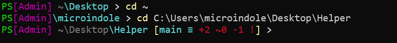

# PowerShell 终端终极美化与性能优化指南

## 前言

本教程旨在将一个原生的 PowerShell 终端，打造成一个既美观、信息丰富，又保持高性能的现代化开发工具。我们将涵盖两种主流的美化路径：

1.  **方案一：Oh My Posh** - 功能强大、主题丰富，适合追求开箱即用和视觉效果的用户。
2.  **方案二：自定义函数** - 追求极致性能、完全可控，适合喜欢DIY和要求终端瞬时响应的用户。

**准备工作：**
* **终端**：推荐使用 **Windows Terminal**。
* **Shell**：PowerShell 7+。
* **工具**：**Git** 已正确安装并配置在系统 PATH 中。

---

## 第一部分：基础准备 - 安装并配置 Nerd Font (所有方案通用)

无论选择哪种美化方案，**Nerd Font** 都是必须的。它是在常规编程字体的基础上，集成了大量图标（如 Git、文件类型、品牌 Logo 等）的特殊字体。

### 1. 下载并安装字体
* **推荐方式 (winget)**：打开 PowerShell，运行以下命令安装 `Caskaydia Cove Nerd Font`。
```powershell
winget install Microsoft.CascadiaCode.NF
```
* **手动方式**：访问 [Nerd Fonts 官网](https://www.nerdfonts.com/font-downloads)，下载 `Cascadia Code` (或 `Caskaydia Cove`)，解压后全选所有字体文件，右键点击“为所有用户安装”。

### 2. 在你的工作环境中启用字体
* **Windows Terminal**:
    * 打开设置 (`Ctrl` + `,`) -> 左侧选择“默认值” -> “外观”。
    * 将“字体”设置为 `CaskaydiaCove NF`。
* **VS Code**:
    * 打开设置 (`Ctrl` + `,`) -> 搜索 `terminal.integrated.fontFamily`。
    * 设置为 `'CaskaydiaCove NF', 'monospace'`。
* **PyCharm / IntelliJ IDEA**:
    * 打开设置 (`Ctrl` + `Alt` + `S`) -> 导航到 `Tools` -> `Terminal`。
    * 将“字体”设置为 `CaskaydiaCove NF`。

---

## 第二部分：方案一 - 功能丰富的 Oh My Posh

此方案能让你快速获得一个功能全面的炫酷终端。

### 1. 安装 Oh My Posh
```powershell
winget install JanDeDobbeleer.OhMyPosh
```

安装后重启终端。


### 2. 配置 PowerShell 自动加载


- 运行 `notepad $PROFILE` 打开或创建你的 PowerShell 配置文件。

- 在文件中添加以下命令：

  PowerShell

  ```
  oh-my-posh init pwsh | Invoke-Expression
  ```

- 保存并关闭文件，重启终端即可看到默认主题。


### 3. （可选）切换或自定义主题


- 运行 `Get-PoshThemes` 可以预览所有内置主题。

- 要切换主题（例如 `slim.omp.json`），请修改 `$PROFILE` 文件中的命令：

  PowerShell

  ```
  oh-my-posh init pwsh --config "$env:POSH_THEMES_PATH/slim.omp.json" | Invoke-Expression
  ```

------


## 第三部分：方案二 - 追求极致性能的自定义函数


此方案放弃了外部主题引擎，通过 PowerShell 内置的 `prompt` 函数和 `posh-git` 模块，手动打造一个美观且响应极快的提示符。


### 1. 安装 posh-git


这是在 PowerShell 中高效获取 Git 状态的核心模块。

```powershell
Install-Module posh-git -Scope CurrentUser
```


### 2. 配置 `$PROFILE` 文件


这是本方案的核心。我们将重写 `prompt` 函数，并确保文件编码正确。

- **步骤 A：编写函数** 运行 `notepad $PROFILE`，**清空**里面所有内容（特别是 Oh My Posh 的命令），然后将下面的**全部代码**粘贴进去：

  ```powershell
  # 导入 posh-git 模块，让我们可以获取 Git 状态
  Import-Module posh-git
  
  # 重写 prompt 函数 (高性能美化版)
  function prompt {
    # 获取当前路径
    $path = $pwd.Path
  
    # 开始构建提示符字符串
    $promptString = "PS $path"
  
    # 获取 Git 状态对象
    $gitStatus = Get-VcsStatus
    if ($gitStatus) {
      # 如果在 Git 仓库里，则追加 Git 状态信息
      $gitString = " [ $($gitStatus.Branch)" # '' 是分支图标
  
      # 检查与远程仓库的同步状态
      if ($gitStatus.AheadBy -gt 0) { $gitString += " ↑$($gitStatus.AheadBy)" } # '↑' 代表本地领先
      if ($gitStatus.BehindBy -gt 0) { $gitString += " ↓$($gitStatus.BehindBy)" } # '↓' 代表本地落后
  
      $gitString += "]" # 闭合括号
      $promptString += $gitString
    }
  
    # 追加结尾符号，并返回最终构建好的、完整的字符串
    $promptString += "❯ "
    return $promptString
  }
  ```
  
- **步骤 B：【关键】保存为正确的文件编码** 为了让 ``、`↑`、`❯` 等图标正确显示，文件编码至关重要。

  - 在记事本中，点击 **文件 -> 另存为...**。
  - 在底部的“编码”选项中，选择 **"UTF-8 with BOM"**。
  - 保存并替换原文件。


### 3. 重新加载配置


在 PowerShell 终端中运行 `. $PROFILE`，即可看到最终效果。

------


## 第四部分：方案对比与选择


| 特性           | 方案一 (Oh My Posh)                | 方案二 (自定义函数)                |
| -------------- | ---------------------------------- | ---------------------------------- |
| **性能**       | 中等至较慢，启动有延迟             | **极致**，几乎瞬时响应             |
| **易用性**     | **高**，开箱即用                   | 中等，需要手动配置代码             |
| **主题生态**   | **极其丰富**，上百种主题可选       | 无，样式完全由自己代码决定         |
| **自定义能力** | 高，通过编辑 JSON 文件             | **完全控制**，通过 PowerShell 脚本 |
| **适合人群**   | 追求视觉效果、不介意轻微延迟的用户 | 追求极限性能、喜欢DIY的开发者      |

------


## 第五部分：后续清理


如果你最终选择了**方案二 (自定义函数)**，可以卸载不再需要的 Oh My Posh。

1. **确认 `$PROFILE` 文件**中已没有任何 `oh-my-posh` 的命令。

2. 运行卸载命令：

   PowerShell

   ```
   winget uninstall JanDeDobbeleer.OhMyPosh
   ```

**再次强调**：无论选择哪个方案，都**不要卸载 Nerd Font 字体**，它是你整个开发环境的宝贵资产。


## 附录：相关主题

> 同目录下有推荐主题
>
> 按照方案二完成后
>
> ```powershell
> code $PROFILE
> ```
>
> 后粘贴即可

- demo1.ps1

  